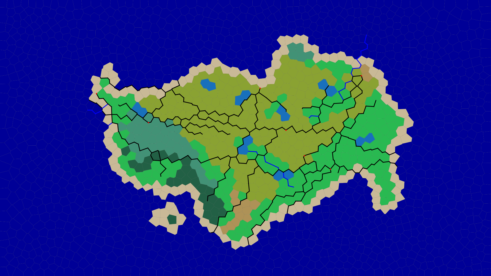

# A4 Island Generation Simulator

  - Author: "Jeremy Orr" <orrj4@mcmaster.ca>
  - Author: "Nathan Perry" <perryn1@mcmaster.ca>
  - Author: "Aidan Goodyer" <goodyera@mcmaster.ca>

## Created Islands Using the Software
  
  
  
## Credit and workload

| Id  | Feature  | Notes | Credited To | 
|:--: | :-----:  | :---: | :---------: |
| F1  | Generate different tiles to differentiate between land and water  | • Create methods for land and water tiles which pass in a tile and give it the proper attributes • Create classes for different tile types or just for general tile assignment? |Nathan Perry|
| F2  | Create a circular island, integrating both types of tiles  | • Produce an algorithm to choose the correct tiles to be made land tiles • Create tile assignment class  |Nathan Perry|
| F3  | Create a third lagoon tile to represent water within the island  | • Add new properties for water inside an island  |Jeremy Orr and Nathan Perry|
| F4  | Identify land tiles touching water and give them a different colour (Beach)  | • Create new tile type with beach properties • Create algorithm to recognize when land tiles touch water tiles  |Aidan Goodyer and Jeremy Orr|
| F5  | Create abstract notion of shape to be extended into different realizations |   • Create shape superclass with shape subclasses, circle is trivial case  |Aidan Goodyer|
| F6  | Implement altimetric profiles  | • Add property of altitude (integer value), use this to adjust other properties • Create algorithm for assigning altitudes (or randomly)  |Nathan Perry|
| F7  | Implenting Elevation with Polygons  | • Add new properties for water inside an island  |Jeremy Orr|
| F8  | Command line option for number of lakes  | • CLI command line option • Create water bodies within the land mass  |All Members|
| F9  | Command line option for number of rivers | • CLI command option • Give segments river properties  |All Members|
| F10  | Implement river behaviour  | • Create algorithm so rivers traverse to lower elevations  |Nathan Perry|
| F11  | Implement river combination  | • Change thickness based on river intersections  |Nathan Perry|
| F12  | Implement soil absorption  | • Compute soil absorption based on humidity and proximity to water• Implement soil profile builder (how much is absorbs soil) • Change properties based on absorption  |Jeremy Orr|
| F13  | Implement aquifer and soil command line option  | • CLI command option • Make specific tiles aquifers and adjust moisture levels of neighbours  |Jeremy Orr|
| F14  | Implement biomes using humidity and temperature (elevation) |  • Use humidity and temperature properties of tiles to determine biome   |All Members|
| F15  |Implement whittaker diagram command line |  • CLI command line option   |Aidan Goodyer|
| F16  |Implement seeds |    • CLI command option • Use given seed to determine properties of the island   |Aidan Goodyer|
| F17  |Create JUnit testing |  • Create the proper classes   |Jeremy Orr and Nathan Perry|
| F18  | Do our A3 report and Update Read Me|  • Finish all questions asked of us in the report • Fix up ReadMe   |All Memebers|


## How to Run the Program

```
### DECORATING AN EXISTING MESH ###
###################################
###################################
(in main directory)
------(to install)------
mvn clean
mvn compile
mvn package
mvn install
------------------------
(in main directory)
java -jar island/island.jar -i (mesh to be read in) -o (mesh to be outputted and visualized) -h (height of input mesh) -w (width of input mesh)

If you do not see the tests run in the terminal try to do the command 'mvn clean install'
-----Other Args -----
-help -> help message 
-l -> activates lagoon option 
-lakes (arg) -> specify number of lakes (int)
-p (arg) -> specify elevation profile (Volcano)
-rivers (arg) -> specify number of rivers (int)
-s (arg) -> shape of island (Circle, irregular(default), Square)
-help -> prints help options

Extended:
-cities (arg) -> speficy the amount of main cities you want
-citysize (arg) -> speficiy big or small city (big/small)
Note: if you do not specify a width and height, it will asume the mesh size is 1920x1080.
Another Note: 1920x1080 are also the dimensions which will produce the richest, most realistic island.

-seed (arg) -> specify the seed controlling randomness (defaults to random seed)(All other arguments must be consistent for perfect reproducability) 

-----For the Bonus-----
-v (arg) -> Specify elevation or moisture visualization (Humidity, Elevation)
-------------------------

Island.sh will install program and generate a new mesh and an island. In order for seeds to work properly, the same mesh must be used so the built.sh script decorates and island but does not produce a new mesh.
```

It creates two jars:

  1. `generator/generator.jar` to generate meshes
  2. `visualizer/visualizer.jar` to visualize such meshes as SVG files

## Extending the Library (City)
I have added my own created Graph Abstract data type. This comes with the implentation of a shorest path algorithm and city system added to the mesh that you create. The args can be seen in the Decorating existing mesh section. You create one hub city where multiple roads lead into it. This means you can have multiple hub cities to enrich your mesh.

### Generating a mesh, grid or irregular

```
mosser@azrael A2 % java -jar generator/generator.jar -k grid -h 1080 -w 1920 -p 1000 -s 20 -o img/grid.mesh
mosser@azrael A2 % java -jar generator/generator.jar -k grid -h 1080 -w 1920 -p 1000 -s 20 -o img/irregular.mesh
```

One can run the generator with `-help` as option to see the different command line arguments that are available

### Visualizing a mesh, (regular or debug mode)

```
mosser@azrael A2 % java -jar visualizer/visualizer.jar -i img/grid.mesh -o img/grid.svg          
mosser@azrael A2 % java -jar visualizer/visualizer.jar -i img/grid.mesh -o img/grid_debug.svg -x
mosser@azrael A2 % java -jar visualizer/visualizer.jar -i img/irregular.mesh -o img/irregular.svg   
mosser@azrael A2 % java -jar visualizer/visualizer.jar -i img/irregular.mesh -o img/irregular_debug.svg -x
```

Note: PDF versions of the SVG files were created with `rsvg-convert`.

| Id  | Feature  | Notes | Status  |  Started  | Delivered |
|:---:| :-----:  | :---: | :----:  |  :-----:  | :-------: |
| F1  | Create GraphADT  | • Implement Nodes and Edges • Create a graph and have the needed testing for it | D  |  Week 1  | Week 1 |
| F2  | Create interface for finding path in nodes  | • Create an interface with methods to find the shortest path | D  |  Week 1  | Week 1 |
| F3  | Create a shortest path algorithm  | • Use Dijkstra's algorithm to find the shorest path • Use Inteface | D  |  Week 1  | Week 1 |
| F4  | Testing Coverage for ADT  | • Create a testing suite for our ADT • Use proper methods and Junit | D  |  Week 1  | Week 1 |
| F5  | Update the ReadMe  | • Document	your project author, rationale, and explanations for extending the	library	by implementing a new algorithm | D |  Week 1  | Week 1 |
| F6 | Add pathfinder as a dependency  | • Add Pathfinder folder to maven depencies using POM.xml file | D |  Week 1  | Week 1 |
| F7 | Add cities at vertexs  | • Randomly pick a vertex that will be the base city | D |  Week 2  | Week 2 |
| F8 | Make a path for the base city to other cities  | • Randomly pick a vertex that will be the base city for the star network| S |  Week 2  | Week 2 |
| F9 | Add amount of cities to Command Line | • Length of Star network and amount of cities to be add | D |  Week 2  | Week 2 |
| F10 | Do questions in doc | • Answer all questions for report| D |  Week 2  | Week 2 |

Backlog:Maybe fix the length to be the length of a segment.

